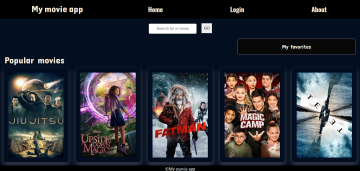
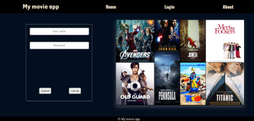
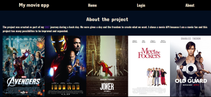
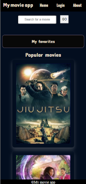

# Movie api

## Introduction

This is a simple movie application that renders the most popular and upcoming movies using the [TMDb API](https://www.themoviedb.org/) which has large collection of information about movies and the [OmdAPi](http://www.omdbapi.com).

The application is build using only vanilla javaScript and the express framework for the backend.

| |  | || |

## How to use it

- **Clone the repo: git@github.com:Danijela2019/Movie-app.git**
- **Install packages: npm install**
- **Run the 'npm start' command**
- **Open your browser at: http://localhost:4000**
- **Or, you can open the app on Heroku [here](https://mymovieapp2020.herokuapp.com/)**
